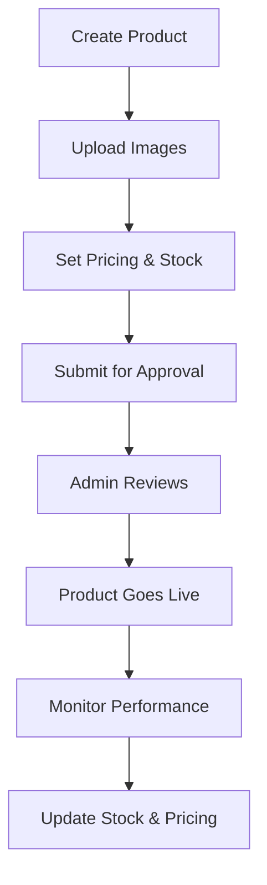
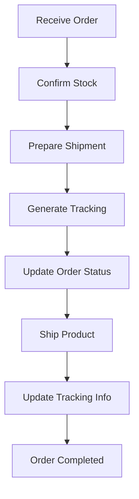

# Supplier Portal - Clothes Shipping Platform

The Supplier Portal is a comprehensive web application that allows clothing manufacturers, wholesalers, and distributors to manage their products, orders, and business relationship with the Clothes Shipping e-commerce platform.

## 🚀 Features

### 🔐 Authentication & Account Management
- **Supplier Registration**: Multi-step registration process with company verification
- **Email Verification**: Secure email verification for new accounts
- **Admin Approval**: All supplier accounts require admin approval before activation
- **Profile Management**: Comprehensive supplier profile with company information
- **Document Upload**: Support for business licenses, certifications, and product catalogs

### 📦 Product Management
- **Product Catalog**: Create and manage product listings with multiple images
- **Inventory Tracking**: Real-time stock level management
- **Category Management**: Organize products by categories and tags
- **Product Status**: Control product visibility (active, inactive, pending approval)
- **Bulk Operations**: Mass update of product information and pricing

### 📋 Order Management
- **Order Processing**: View and process orders from the main platform
- **Order Status Updates**: Update fulfillment status and tracking information
- **Order History**: Complete order history with filtering and search
- **Customer Information**: Access to customer details for order fulfillment
- **Shipping Integration**: Integration with DHL for tracking and logistics

### 📊 Analytics & Reporting
- **Sales Dashboard**: Real-time sales performance metrics
- **Product Performance**: Top-selling products and analytics
- **Order Analytics**: Order trends and fulfillment metrics
- **Revenue Tracking**: Monthly and yearly revenue reporting
- **Export Functionality**: Download reports in CSV and PDF formats

### 💼 Business Tools
- **Commission Tracking**: View commission rates and earnings
- **Payment Management**: Track payments and outstanding balances
- **Support System**: Integrated support ticket system
- **Notifications**: Real-time notifications for orders and updates
- **Multi-language Support**: Interface available in multiple languages

## 🛠 Technical Architecture

### Frontend Stack
- **React 18**: Modern React with hooks and context API
- **Material-UI v5**: Google's Material Design components
- **React Router v6**: Client-side routing and navigation
- **React Query**: Data fetching and caching
- **Formik & Yup**: Form handling and validation
- **Recharts**: Charts and data visualization
- **Vite**: Fast development build tool

### Backend Integration
- **RESTful API**: Comprehensive API for all supplier operations
- **JWT Authentication**: Secure token-based authentication
- **File Upload**: Support for product images and documents
- **Real-time Updates**: WebSocket integration for live notifications
- **Rate Limiting**: API rate limiting for security

## 📁 Directory Structure

```
supplier-portal/
├── public/
│   ├── index.html
│   └── favicon.ico
├── src/
│   ├── components/
│   │   ├── common/          # Reusable components
│   │   ├── forms/           # Form components
│   │   ├── layout/          # Layout components
│   │   └── charts/          # Chart components
│   ├── contexts/
│   │   ├── AuthContext.jsx  # Authentication context
│   │   └── ThemeContext.jsx # Theme context
│   ├── hooks/
│   │   ├── useAuth.js       # Authentication hook
│   │   ├── useApi.js        # API interaction hook
│   │   └── useLocalStorage.js
│   ├── pages/
│   │   ├── auth/            # Authentication pages
│   │   ├── dashboard/       # Dashboard pages
│   │   ├── products/        # Product management
│   │   ├── orders/          # Order management
│   │   ├── analytics/       # Analytics pages
│   │   └── settings/        # Settings pages
│   ├── services/
│   │   ├── api.js          # API service layer
│   │   ├── auth.js         # Authentication service
│   │   └── storage.js      # Local storage utilities
│   ├── utils/
│   │   ├── helpers.js      # Utility functions
│   │   ├── constants.js    # Application constants
│   │   └── validators.js   # Validation schemas
│   └── App.jsx             # Main application component
├── package.json
└── vite.config.js
```

## 🚦 Getting Started

### Prerequisites
- Node.js 18+ and npm/yarn
- Running backend API server
- Valid supplier account (approved by admin)

### Installation

1. **Navigate to supplier portal directory**:
   ```bash
   cd supplier-portal
   ```

2. **Install dependencies**:
   ```bash
   npm install
   # or
   yarn install
   ```

3. **Set up environment variables**:
   ```bash
   # Create .env file
   cp .env.example .env
   
   # Configure your environment
   REACT_APP_API_URL=http://localhost:3001/api
   REACT_APP_WS_URL=ws://localhost:3001
   ```

4. **Start the development server**:
   ```bash
   npm run dev
   # or
   yarn dev
   ```

5. **Access the application**:
   - Open http://localhost:3002 in your browser
   - Register as a new supplier or login with existing credentials

## 🔑 Supplier Registration Process

1. **Application Submission**:
   - Fill out company information
   - Provide contact details
   - Describe business type and products
   - Upload required documents

2. **Email Verification**:
   - Verify email address via confirmation link
   - Account remains pending until verified

3. **Admin Review**:
   - Admin reviews application and documents
   - Application can be approved, rejected, or require additional information

4. **Account Activation**:
   - Approved suppliers receive activation email
   - Can access full portal functionality

## 🎯 Key Supplier Workflows

### Product Management Workflow


### Order Fulfillment Workflow


## 📊 Dashboard Features

### Key Metrics
- **Total Products**: Number of listed products
- **Active Products**: Currently available products
- **Total Orders**: All-time order count
- **Monthly Revenue**: Current month earnings
- **Pending Orders**: Orders awaiting processing
- **Average Rating**: Product rating average

### Charts & Analytics
- **Sales Overview**: Monthly sales trends
- **Product Performance**: Top-selling products
- **Order Status Distribution**: Order fulfillment breakdown
- **Revenue Trends**: Historical revenue data

## 🔒 Security Features

### Authentication Security
- **JWT Tokens**: Secure access and refresh tokens
- **Token Rotation**: Automatic token refresh
- **Session Management**: Secure session handling
- **Password Security**: Strong password requirements

### Data Protection
- **Input Validation**: Comprehensive form validation
- **XSS Protection**: Cross-site scripting prevention
- **CSRF Protection**: Cross-site request forgery protection
- **File Upload Security**: Safe file handling and validation

### API Security
- **Rate Limiting**: API call rate limiting
- **Request Validation**: Server-side input validation
- **Error Handling**: Secure error messages
- **Audit Logging**: Security event logging

## 📱 Mobile Responsiveness

The supplier portal is fully responsive and works seamlessly on:
- **Desktop**: Full-featured experience
- **Tablet**: Optimized layout for medium screens
- **Mobile**: Touch-friendly mobile interface

## 🌐 Internationalization

Supported languages:
- **English** (default)
- **German** (Deutsch)
- **Portuguese** (Português)
- **French** (Français)
- **Spanish** (Español)

## 🚀 Deployment

### Production Build
```bash
# Build for production
npm run build

# Preview production build
npm run preview
```

### Deployment Options
- **Netlify**: Static site deployment
- **Vercel**: Serverless deployment
- **AWS S3**: Static website hosting
- **Traditional Hosting**: Standard web server deployment

## 📈 Performance Optimization

### Code Splitting
- **Route-based splitting**: Automatic code splitting by routes
- **Component splitting**: Lazy loading of heavy components
- **Library splitting**: Separate vendor bundles

### Caching Strategy
- **React Query**: Intelligent data caching
- **Browser Caching**: Static asset caching
- **API Response Caching**: Server-side response caching

### Bundle Optimization
- **Tree Shaking**: Unused code elimination
- **Asset Optimization**: Image and asset compression
- **Gzip Compression**: Server-side compression

## 🧪 Testing

### Testing Stack
- **Jest**: Unit testing framework
- **React Testing Library**: Component testing
- **MSW**: API mocking for tests
- **Cypress**: End-to-end testing

### Running Tests
```bash
# Unit tests
npm test

# E2E tests
npm run cypress:open

# Coverage report
npm run test:coverage
```

## 📞 Support & Documentation

### Getting Help
- **Support Tickets**: In-app support system
- **Email Support**: support@clothesshipping.com
- **Documentation**: Comprehensive user guides
- **Video Tutorials**: Step-by-step tutorials

### API Documentation
- **Swagger/OpenAPI**: Interactive API documentation
- **Postman Collection**: Ready-to-use API collection
- **Code Examples**: Implementation examples

## 🔄 Updates & Maintenance

### Version Control
- **Git Workflow**: Feature branch workflow
- **Semantic Versioning**: Clear version numbering
- **Release Notes**: Detailed release documentation

### Monitoring
- **Error Tracking**: Automatic error reporting
- **Performance Monitoring**: Application performance metrics
- **User Analytics**: Usage statistics and insights

## 🎯 Future Enhancements

### Planned Features
- **Mobile App**: Native mobile application
- **Advanced Analytics**: More detailed reporting
- **AI Recommendations**: Product optimization suggestions
- **Integration APIs**: Third-party system integrations

### Roadmap
- **Q1 2024**: Mobile app development
- **Q2 2024**: Advanced analytics dashboard
- **Q3 2024**: AI-powered recommendations
- **Q4 2024**: Extended API integrations

---

The Supplier Portal is a comprehensive solution designed to empower clothing suppliers with the tools they need to succeed in the global e-commerce marketplace. With its modern architecture, user-friendly interface, and powerful features, it provides suppliers with everything needed to manage their business effectively and grow their sales through the Clothes Shipping platform.